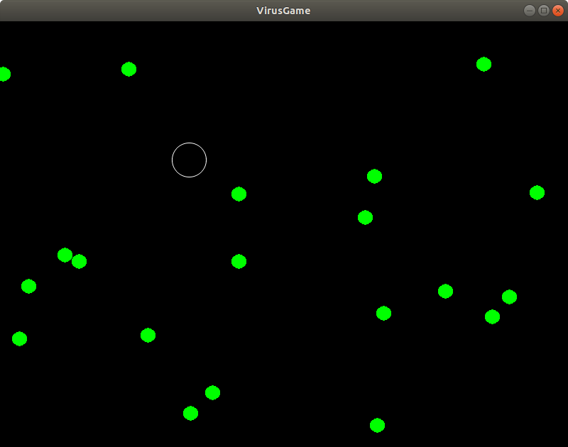

# VirusGame #
A simple game build using the SDL2 graphics library. Use
the cursor keys to move to escape/kill the viruses.

## Install

### Linux/Mac:

Using the package manager on your system to install:

    cmake
    git
    libsdl2-dev
    libsdl2-gfx-dev

For example for Ubuntu use:

    sudo apt install cmake git libsdl2-dev libsdl2-gfx-dev

For example for a Mac probably something like (run 'brew search sdl' to see which are available):

    brew install cmake git sdl sdl_gfx

Then:

    git clone https://bterwijn@bitbucket.org/bterwijn/virusgame.git
    cd virusgame/src
    mkdir build
    cd build
    cmake ..
    make
    ./VirusGame

### Windows:

Install [git](https://git-scm.com/download/win) and clone
[VirusGame](https://bitbucket.org/bterwijn/virusgame/src/master).

Install [Visual Studio Studio Community
2019](https://visualstudio.microsoft.com/) and in the Visual Studio
Installer install Worksload "Desktop development with C++" (includes
CMake).

Install the SDL2 graphics library use
[vcpkg](https://github.com/Microsoft/vcpkg) by using:

    git clone https://github.com/Microsoft/vcpkg.git
    cd vcpkg
    .\bootstrap-vcpkg.bat
    .\vcpkg.exe integrate install
    .\vcpkg.exe install sdl2
    .\vcpkg.exe install sdl2-gfx --triplet x64-windows

Then in Visual Studio Studio Community 2019 open the virusgame/src
folder and build the project (F7) and run it (F5).

## Documentation
For documentation see the 
[list of classes]( http://sbt.science.uva.nl/bterwijn/virusgame/doc/html/annotated.html "Doxygen documentation")

## Author
Bas Terwijn <<b.terwijn@uva.nl>>

## Description of extension by student
My extension ...
